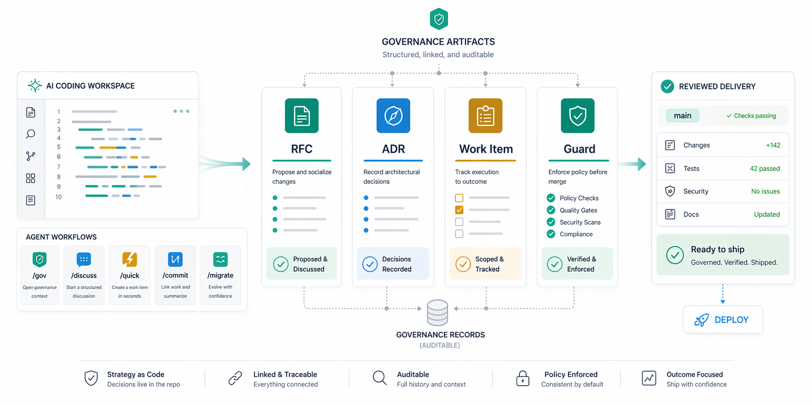

<p align="center">
  
</p>

<h1 align="center">govctl</h1>

<p align="center">
  <a href="https://github.com/govctl-org/govctl/actions/workflows/ci.yml"></a>
  <a href="https://codecov.io/gh/govctl-org/govctl"></a>
  <a href="https://crates.io/crates/govctl"></a>
  <a href="https://opensource.org/licenses/MIT"></a>
  <a href="https://discord.gg/buBB9G8Z6n"></a>
  <a href="https://github.com/govctl-org/govctl"></a>
</p>

<p align="center">
  <strong>A governance harness for AI coding.</strong><br>
  <em>Turn prompts and patches into RFCs, ADRs, work items, and guarded delivery.</em>
</p>

<p align="center">
  
</p>

---

`govctl` is a governance-as-code CLI for teams using AI to build software seriously.

It gives AI-assisted development a control plane that lives in your repo:

- **RFCs** say what must be true
- **ADRs** record why a design was chosen
- **Work items** track execution and acceptance criteria
- **Verification guards** enforce executable completion gates

The point is not bureaucracy. The point is that AI-generated changes become **reviewable, traceable, and phase-gated**.

## Why govctl

Most AI coding tools optimize for generation. `govctl` optimizes for delivery.

Without explicit governance, teams drift into the same pattern:

- ideas jump straight into implementation
- decisions live in chat history instead of artifacts
- code and specs diverge silently
- "done" means "the agent stopped typing", not "the work passed verification"

`govctl` closes that gap by making governed artifacts, lifecycle, and verification part of the normal workflow.

```text
Without govctl:
  prompt -> code -> drift -> arguments

With govctl:
  RFC / ADR -> work item -> guarded implementation -> stable history
```

## What Makes It Different

### 1. Spec-first by default

`govctl` is built around the idea that implementation follows governed artifacts.

In practice, that means:

- RFCs describe externally relevant behavior and constraints
- ADRs record design choices and trade-offs
- work items execute against those artifacts
- verification guards and lifecycle gates decide when work is actually done

Instead of treating prompts as the source of truth, the source of truth becomes governed artifacts in the repository.

### 2. Artifacts are the control plane

`govctl` does not hide governance behind a web app or an MCP server.

Artifacts live in `gov/` as TOML files with schema headers, references, and stable CLI access. That means:

- changes are diffable
- decisions are reviewable in PRs
- agents can operate against files and commands you already understand

### 3. One CLI agents can reliably operate

The CLI is the operating surface for agents:

- `list`, `show`, `get`, `edit`
- resource-specific lifecycle verbs like `adr accept`, `rfc advance`, `rfc supersede`, and `work move`
- path-first mutation through `edit`
- explicit help text designed to act as a reliable command contract

This matters because agent workflows get better when the interface is stable, local, and inspectable.

### 4. Works in brownfield repositories

This is not only for greenfield projects.

For existing repositories, the `/migrate` workflow helps you adopt governance incrementally: discover undocumented decisions, backfill ADRs, and establish governed artifacts without restarting the project.

## Quick Start

### CLI

```bash
# Install from source
cargo install govctl

# Or install a prebuilt binary (faster, skips compilation)
cargo binstall govctl

govctl init
govctl status
```

To update an existing installation:

```bash
govctl self-update
```

Then create your first governed artifacts:

```bash
govctl rfc new "Caching Strategy"
govctl adr new "Choose cache backend"
govctl work new --active "implement caching"
```

### Agent workflow

Run `govctl init` and use the installed workflows with your agent:

- `/discuss <topic>` to draft RFCs and ADRs
- `/gov <task>` to execute governed implementation
- `/quick <task>` for intentionally small changes
- `/commit` to record work with governance checks

For Claude Code plugin installation:

```bash
/plugin marketplace add govctl-org/govctl
/plugin install govctl@govctl
/govctl:init
```

For a global Codex installation:

```bash
mkdir -p ~/.codex
cd ~/.codex
govctl init
govctl init-skills --format codex --dir .
```

This keeps the govctl-managed workspace, generated skills, and generated agents inside `~/.codex` instead of writing governance files into your home directory.

### A concrete example

```bash
govctl rfc new "Verification Guard Policy"
govctl clause new RFC-0015:C-GUARD-REQUIREMENTS "Required guards" -s "Verification" -k normative
govctl adr new "Require clippy on parser refactors"
govctl work new --active "add parser lint guard"
```

## Core Capabilities

### Canonical artifact operations

Agents and humans work through a stable CLI contract.

Read the exact field you need:

```bash
govctl rfc get RFC-0001 status
```

For precise artifact mutation, `govctl` provides a canonical path-first interface:

```bash
govctl adr edit ADR-0038 decision --stdin
govctl work edit WI-2026-01-17-001 acceptance_criteria[0].status --set done
govctl clause edit RFC-0002:C-CRUD-VERBS text --stdin
```

This is not the product's identity. It is the low-level tool agents use to update governed artifacts precisely and consistently.

### Verification guards

Guards are executable checks that run when work reaches completion gates.

Define reusable project defaults in `gov/config.toml`:

```toml
[verification]
enabled = true
default_guards = ["GUARD-GOVCTL-CHECK", "GUARD-CARGO-TEST"]
```

You can also require extra guards on a specific work item or waive a guard with an explicit reason. See:

- [Validation & Rendering](https://github.com/govctl-org/govctl/blob/main/docs/guide/validation.md#per-work-item-guards)
- [Working with Work Items](https://github.com/govctl-org/govctl/blob/main/docs/guide/work-items.md#per-work-item-guards)

### Brownfield adoption vs format migration

These are related, but different:

- **`/migrate` workflow** — adopt `govctl` in an existing repository by discovering decisions, backfilling ADRs, and introducing governance incrementally
- **`govctl migrate` command** — upgrade existing `govctl`-managed artifacts to the current on-disk format and schema

For format upgrades:

```bash
govctl migrate
govctl check
```

As of the `0.8.x` line, RFC and clause artifacts are written canonically as TOML. Legacy JSON is supported for migration and compatibility on read, not as an ongoing write format.

### Interactive TUI

```bash
govctl tui
```

Browse RFCs, ADRs, work items, and guards with styled rendering in the terminal.

## Who This Is For

- Teams using Claude Code, Codex, Cursor, or similar agents for real product work
- Projects that want AI assistance without losing reviewability
- Brownfield repositories that need governance without a rewrite
- Engineers who want specs, decisions, and work tracking to live in the repo

## Documentation

- [User Guide](https://govctl-org.github.io/govctl/)
- [Validation & Rendering](https://github.com/govctl-org/govctl/blob/main/docs/guide/validation.md)
- [Working with Work Items](https://github.com/govctl-org/govctl/blob/main/docs/guide/work-items.md)
- [Changelog](https://github.com/govctl-org/govctl/blob/main/CHANGELOG.md)
- [Website](https://govctl.org)

## Community

- [Discord](https://discord.gg/buBB9G8Z6n)
- [GitHub Issues](https://github.com/govctl-org/govctl/issues)
- [GitHub Discussions](https://github.com/govctl-org/govctl/discussions)

## Contributing

`govctl` is intentionally opinionated:

- features start with governed artifacts, not implementation-first
- RFCs and ADRs are part of the product, not side documentation
- verification and lifecycle are core behavior, not optional extras

If that matches how you want AI-assisted development to work, contributions are welcome.

---

## License

MIT

## Star History

<a href="https://star-history.com/#govctl-org/govctl&Date">
 <picture>
   <source media="(prefers-color-scheme: dark)" srcset="https://api.star-history.com/svg?repos=govctl-org/govctl&type=Date&theme=dark" />
   <source media="(prefers-color-scheme: light)" srcset="https://api.star-history.com/svg?repos=govctl-org/govctl&type=Date" />
   
 </picture>
</a>

---

> _"Discipline is not the opposite of creativity. It is the foundation."_
